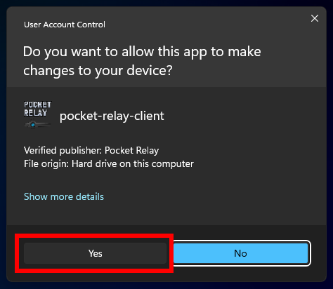

import WindowsIcon from "../../src/components/icons/WindowsIcon";
import Tabs from "@theme/Tabs";
import TabItem from "@theme/TabItem";

# Joining a server

Welcome to Pocket Relay! This guide will walk you through joining Pocket Relay servers using the **Pocket Relay Client**. If you've already downloaded the client, you can skip to [Connection URL](#3-connection-url).

:::info
This guide focuses on the **Pocket Relay Client**, a tool that requires administrator privileges and must run continuously while you play. There is an alternative client plugin version available which doesn't require admin privileges and can be closed once you are 
connected. Check out the [Plugin Client Guide](./5-plugin-client.mdx) for more details.
:::

:::tip
If you are using the **Steam** version of Mass Effect 3 you may run into connection issues if you're trying 
to play with others on Pocket Relay Client, if run into connection issues try using the [Plugin Client Guide](./5-plugin-client.mdx) instead
:::

## Requirements

To run the **Pocket Relay Client**, ensure you have the following:

- **64bit Windows 10 or newer**
  - The client may run on older versions of Windows, but it's untested.
  - If you would like to run the client on a 32bit system you must compile it manually for that target, alternatively the client plugin version supports 32bit out of the box
- **Administrator Privileges**
  - You need admin privileges to use the client.
- **Mass Effect 3**
  - Start Pocket Relay before launching ME3 for it to work.

## 1) Download client

Download the client from one of the links below:

:::info
The _Windows Native_ version is lighter in terms of file size but less visually appealing. 
:::

| Variant                       | Link                                                                                                      |
| ----------------------------- | --------------------------------------------------------------------------------------------------------- |
| <WindowsIcon /> Windows        | [Download](https://github.com/PocketRelay/Client/releases/latest/download/pocket-relay-client.exe)        |
| <WindowsIcon /> Windows Native | [Download](https://github.com/PocketRelay/Client/releases/latest/download/pocket-relay-client-native.exe) |

:::tip
Remember where you save the executable, as you'll need it whenever you want to connect to a Pocket Relay server.
:::

The client auto-updates, so no need to repeat this step for new versions.

---

## 2) Starting the client

After downloading, locate and open the executable.

### Windows Administrator

Windows will prompt you _"Do you want to allow this app to make changes to your device?"_. This is because the current version of Pocket Relay requires modifying a system
file in order to redirect the game traffic see the [Client Technical Overview](../technical/client.md#hosts-file) to
see what is happening behind the scenes

To this prompt you must press **"Yes"** otherwise the app will not launch

:::info
The above screenshot is of the Windows 11 prompt, this may look slightly different on older versions of Windows
:::

### Windows Firewall

When launching the client for the first time you will see a message similar to the following from **Windows Defender Firewall** saying that it has blocked some features of the app.

This message appears because the client locally runs a server and Windows Firewall is preventing other devices on your network from accessing the client-side server _(This is okay and usually the ideal behavior for a Pocket Relay Client as theres no need for other devices on your network to access your client)_

For this prompt you can either press **"Cancel"** or **"Allow access"** as this has no affect on the client

:::info
This message will only appear when you launch the client for the first time, you shouldn't see it again
as Windows will remember your choice
:::

### Launched

After the prompts, you should see a window like the one below:

import clientBaseImage from "./img/client-base.png";
import clientBaseNativeImage from "./img/client-base-native.png";

> As new versions are released the appearance may differ

<Tabs groupId="client-variant">
  <TabItem value="client" label="Client" default>
    </img>
  </TabItem>
  <TabItem value="client-native" label="Native Client">
    </img>
  </TabItem>
</Tabs>

:::tip
Click on the tab above to view the screenshot for your specific version.
:::

## 3) Connection URL

To connect to a **Pocket Relay** server, enter the "Connection URL" provided by the server into the input box.

Enter your server connection URL into this box (You should have been provided this by the person running the server you are trying to connect to). If you
are running your own server refer to the [Connection URL](../server/2-executable.mdx#4-connection-url) section in the server documentation for how to find it.

import clientUrlImage from "./img/client-url.png";
import clientUrlNativeImage from "./img/client-url-native.png";

<Tabs groupId="client-variant">
  <TabItem value="client" label="Client" default>
    </img>
  </TabItem>
  <TabItem value="client-native" label="Native Client">
    </img>
  </TabItem>
</Tabs>

After you have entered the server connection URL into the box press the **"Set"** button and you should connect to the server.

## 4) Done

After pressing "Set" the Pocket Relay Client should now show a "Connected: " message under the URL box this means you're now
connected and you can go start **Mass Effect 3** and play on the server.

import clientConnectedImage from "./img/client-connected.png";
import clientConnectedNativeImage from "./img/client-connected-native.png";

<Tabs groupId="client-variant">
  <TabItem value="client" label="Client" default>
    </img>
  </TabItem>
  <TabItem value="client-native" label="Native Client">
    </img>
  </TabItem>
</Tabs>

:::tip
If you are using an "Unofficial" copy of the game you should also check out the [Unlinked Accounts](./9-unlinked-accounts.md) guide
:::
