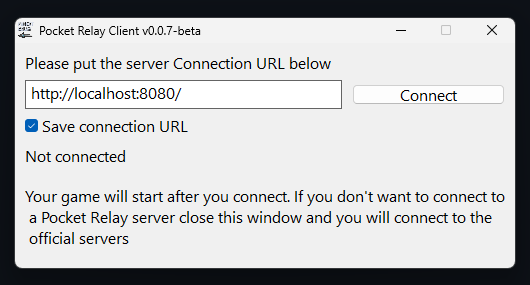
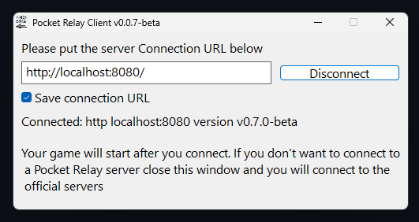

import WindowsIcon from "../../src/components/icons/WindowsIcon";
import LinuxIcon from "../../src/components/icons/LinuxIcon";
import Tabs from "@theme/Tabs";
import TabItem from "@theme/TabItem";

# Joining a server

Welcome to Pocket Relay! This guide will walk you through joining Pocket Relay servers using the **Pocket Relay Plugin Client**.

:::info

This guide focuses on the **Pocket Relay Plugin Client** which is now considered the recommended way of using **Pocket Relay**. This
guide references using the Installer, if you would prefer to manually add the plugin you can follow the [Plugin Client Manual Install Guide](11-plugin-client-manual.mdx)

You can find a guide for using the standalone version of **Pocket Relay** [Here](./12-standalone-client.mdx). However, this is not recommended as it will 
not receive the same level of support and future updates that the plugin client will get it also requires  administrator privileges and must run continuously while you play.
:::

## 1) Download the installer

Download the installer from the link for your platform below:

| Variant                       | Link                                                                                                      |
| ----------------------------- | --------------------------------------------------------------------------------------------------------- |
| <WindowsIcon /> Windows        | [Download](https://github.com/PocketRelay/PocketRelayPluginInstaller/releases/latest/download/pocket-relay-plugin-installer.exe)        |
| <LinuxIcon /> Linux | [Download](https://github.com/PocketRelay/PocketRelayPluginInstaller/releases/latest/download/pocket-relay-plugin-installer) |

---

## 2) Select game path

After downloading, locate and open the executable. You should see this first screen asking you to choose the game path:

Click the "Choose game path" button. Navigate to your Mass Effect 3 install and head into the "Binaries" then "Win32" folder to find your "MassEffect3.exe" file and select that.

---

## 3) Apply Patch

After you've selected the path you should see the following screen:

From here you can press "Apply Patch", then it should change to "Patch successfully installed.". 

:::note
If you already have a patch applied and it says "Remove Patch" you can skip this step, you will
likely already be patched if you have modded the game previously.
:::

:::info
This patch will allow the game to load the plugin for **Pocket Relay** for more technical details about the patch check out [Bink Patch](../technical/client/bink-patch.md)
:::

---

## 4) Add Plugin

After you've applied the patch you can install the plugin. Press the "Add Plugin" button to install the plugin

:::note
You can optionally press the selector next to "Add Plugin" to choose between the "Stable" and "Beta" releases of the plugin
:::

After installing you should see "Pocket realy client plugin successfully installed."

---

## 5) Connecting

When you next start Mass Effect 3 you will see the following window appear:

Enter your server connection URL into this box (You should have been provided this by the person running the server you are trying to connect to). If you
are running your own server refer to the [Connection URL](../server/2-executable.mdx#4-connection-url) section in the server documentation for how to find it.

Once you've entered the Connection URL press the **"Connect"** button to connect to the server. 

---

## 6) Done

Once you connect the the server you should see the following:

At this point you are now connected to the server and can play the game normally. Once you are connected to a server you can safely close the "Pocket Relay Client Plugin" window
and you will stay connected to the server.

After pressing "Connect" the game will now start normally. If you'd like to connect to the official servers instead, press the close button on the window and the game will start 
normally connected to the official servers.

:::tip
If you are using an "Unofficial" copy of the game you should also check out the [Unlinked Accounts](./8-unlinked-accounts.md) guide
:::

---

## 7) Playing without Pocket Relay

If you would like to play on the official servers you don't need to remove this plugin, simply close the Pocket Relay Client Plugin window when the game 
starts and you'll connect to the official servers instead

---
