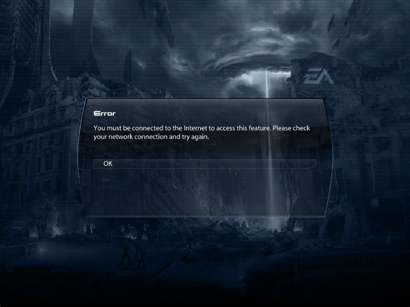

# Playing completely offline

Playing completely offline, as in completely disconnecting your device from any network works out of the box with the client plugin, however the standalone version will not work correctly without a plugin mentioned below.

:::note
You can only play completely offline if you are using a copy of the game that doesn't have EA/Origin DRM. If your exe has DRM you will be forced 
to launch the game through EA/Origin which requires internet to launch. To play completely offline you'll need to obtain an unofficial copy of the
.exe without DRM. I cannot provide guides or links to any of these things so you must obtain them yourself 
:::

The standalone version is limited by the fact that it is not directly apart of the game which results in the game doing some extra network checks which will fail when the device is completely disconnected from the internet and you'll end up seeing this error message in game:

To solve this issue you can add the following plugin to your game which tricks your game into thinking its online

[ME3 Offline Plugin](https://github.com/PocketRelay/me3-offline-plugin)
[Plugin Download](https://github.com/PocketRelay/me3-offline-plugin/releases/latest/download/me3-offline-plugin.asi)