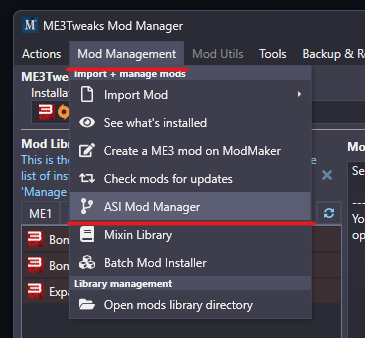
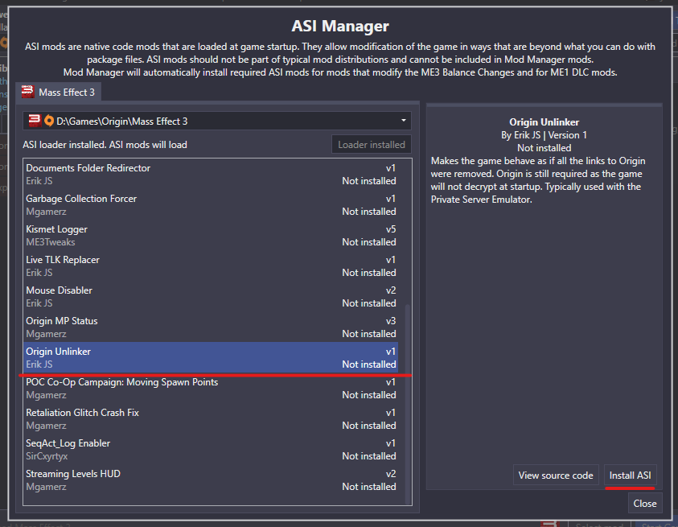
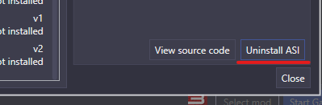

# Unlinking from Origin

Guide for un-linking your game from Origin to allow creating accounts in-game

If you are using an Origin version of the game (Origin, EA Desktop, or Steam) these versions all lock you into authenticating through **Origin**

In order to enable the login screen in-game so that you can login using a email and password (Creating new accounts in-game as well) you can follow
the steps below

:::info
If you are using ME3 Tweaks Mod Manager see [ME3 Tweaks Mod Manager](#me3-tweaks-mod-manager)
:::

:::note
Un-linking from Origin does **NOT** remove the requirement for having Origin installed, this only applies to within the game, Origin/EA Desktop will still be required for the game to launch
:::

Once you've unlinked from Origin check out the [Unlinked Accounts](./9-unlinked-accounts.md) guide for creating and logging into unlinked accounts

## Manual Guide

Documentation for manually applying this plugin is not yet added

## ME3 Tweaks Mod Manager

If you are using **ME3 Tweaks Mod Manager** you can enable this functionality through the "Mod Management" tab and selecting the "ASI Mod Manager" button:

The "ASI Manager" window will pop-up in this window you can scroll through the list of ASI mods until you find **"Origin Unlinker"** once you've found it click
it and press the **"Install ASI"** button to install it:

After that you should now be unlinked from **Origin** and next time you launch the game you will be able to login using the in-game menu.

You can revert this at any time by heading back to the "ASI Manager" screen and pressing **"Uninstall ASI"** on the **"Origin Unlinker"** ASI mod

