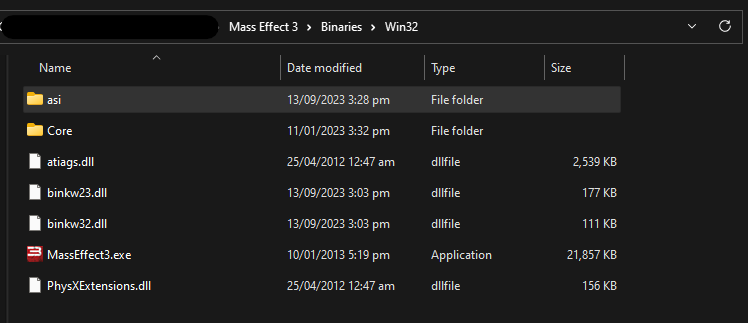

# Unlinking from Origin

Guide for un-linking your game from Origin to allow creating accounts in-game

If you are looking to have your player data pulled over from the official servers you must first login without unlinking, because unlinked accounts operate completely
independently of the official servers so they have no player data associated to them by default.

:::note
Unlinking from Origin doesn't disable DRM or remove the requirement for launching from EA/Origin. These
are still required if you are using a Stream/Origin/EA copy. Unlinking from Origin just disconnects your 
Origin account in-game so you can play with a custom account. 

You still need a valid license in order for the game to decrypt itself. This is NOT a crack or Origin disabler
tool
:::

If you are using an Origin version of the game (Origin, EA Desktop, or Steam) these versions all lock you into authenticating through **Origin**

In order to enable the login screen in-game so that you can login using a email and password (Creating new accounts in-game as well) you can follow
the steps below

:::info
If you are using ME3 Tweaks Mod Manager see [ME3 Tweaks Mod Manager](#me3-tweaks-mod-manager)
:::

Once you've unlinked from Origin check out the [Unlinked Accounts](./9-unlinked-accounts.md) guide for creating and logging into unlinked accounts

## Manual Guide

Documentation for manually applying this plugin is not yet added

### 1) Patching

In order to use the plugin client your game must be patched with a "Bink Bypass" because this allows loading plugins. 
For instructions on how to apply this patch you can check out [Binkw32](./8-binkw32.md)

:::info
If you have already previously patched your game using **Pocket Relay** client, manually, or using some other tool you can skip
to [2) Download plugin](#2-download-plugin)
:::

### 2) Download plugin

Once you've patched your game you can download the Origin unlinker plugin:

[Download](https://github.com/Erik-JS/ME3-ASI/raw/master/ME3OriginUnlinker/Release/ME3OriginUnlinker.asi)

### 3) Adding plugin

Once you've download the plugin head over to the folder containing `MassEffect3.exe` which should look similar to the following

> If you haven't added any other plugins previously then you might not have the "asi" folder

If your folder **doesn't** contain a `asi` folder you will need to create a new folder, ensure that you name it `asi` (Exactly)

Place the `ME3OriginUnlinker.asi` file that you have downloaded into the `asi` folder

All done, you can now start Mass Effect 3 and you will not be linked to an Origin account

### Removing plugin

If you would like to go back to your normal account, simply delete the `ME3OriginUnlinker.asi` file from the `asi` folder and you will be using your Origin/EA account like normal

## ME3 Tweaks Mod Manager

If you are using **ME3 Tweaks Mod Manager** you can enable this functionality through the "Mod Management" tab and selecting the "ASI Mod Manager" button:

The "ASI Manager" window will pop-up in this window you can scroll through the list of ASI mods until you find **"Origin Unlinker"** once you've found it click
it and press the **"Install ASI"** button to install it:

After that you should now be unlinked from **Origin** and next time you launch the game you will be able to login using the in-game menu.

You can revert this at any time by heading back to the "ASI Manager" screen and pressing **"Uninstall ASI"** on the **"Origin Unlinker"** ASI mod

