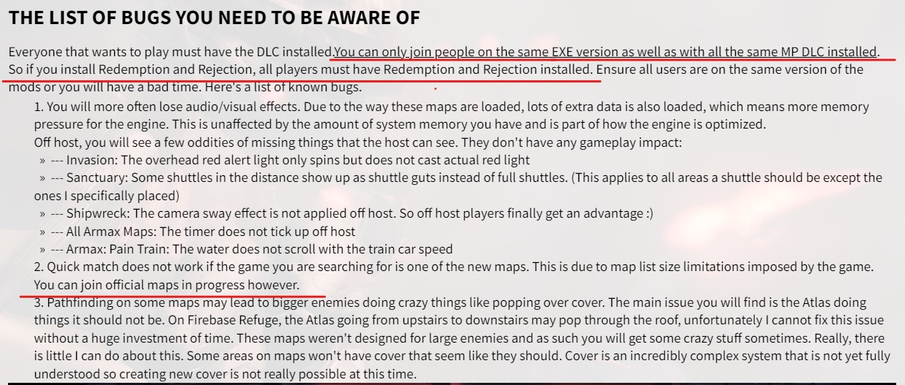

# Modded game

Notes about using the server with a modded game

:::info
Its recommended that you ensure you and everyone you intend on playing with has the same DLC / multiplayer mods installed to prevent any incompatibility
:::

## Redemption / Rejection

If you have the [Redemption](https://me3tweaks.com/mods/showcase?id=35) mod installed, you will only be able to connect to other players that have the mod installed as well. Attempting to join a player that doesn't have the mod installed (Including through quick match) even if you're searching for a vanilla map you will be removed from the game.

This looks to be some sort of client incompatibility when these mods are installed and doesn't seem to be something that I can fix on the server side. Attempting to join someone without the mod installed regardless of the map seems to immediately boot out the player attempting to join right after joining completes. I expect this behavior will also be reflected in other multiplayer mods like "Rejection", attached is a screenshot from the "Redemption" mod page that seems to show that this behavior is something that also happens on the official servers.

:::info
The screenshot above suggests that you can join official maps that are already in progress, this has not been tested on Pocket Relay but will likely work if it's something that works on the official servers
:::
