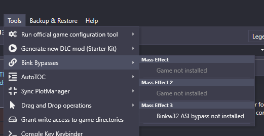
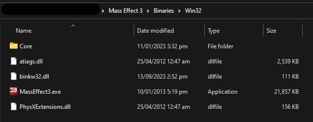

# Binkw32

:::info
Below is an explaination of the `binkw32.dll` patch, you can skip to the content [Here](#applying)
:::

## Explaination

The `binkw32.dll` patch is a DLL that you add to your Mass Effect 3 installation to allow various features of **Pocket Relay** but it also has other use cases such as Modding

The standard `binkw32.dll` is a [DLL (Dynamic Link Library)](https://en.wikipedia.org/wiki/Dynamic-link_library) file thats commonly used in games, the normal DLL provides [Bink Video](https://en.wikipedia.org/wiki/Bink_Video) support to the game. However, in the case of modding and for **Pocket Relay** we use a custom DLL that replaces this allowing us to access the game and load our own code (While still allowing the game to use the old version under the hood)

The [custom version](https://github.com/Erik-JS/masseffect-binkw32) commonly used with **Mass Effect 3** does the following things:

- **Disables DLC Verification**: By disabling the DLC verification it allows the game to load DLCs that aren't valid, this allows modders to make DLC mods, but this also fixes a bug where sometimes DLC you own might not be verified when you connect to _Pocket Relay_
- **Disables SSL certificate validation**: By disabling the certificate verification of Mass Effect 3 it allows the game to connect to servers that aren't using the EA certificate (Previously Pocket Relay required this but we have since bypassed this requirement without the need for this)
- **ASI Plugin Loading**: The custom version allows loading `.asi` plugin files which allow custom code to be run, this is used by the _Pocket Relay Plugin Client_ to work without requiring any Administrator permissions but running the client directly inside Mass Effect 
- **Enables Console**: Enables the in-game console

---

## Applying

Below are the instructions for applying the `binkw32.dll` patch

:::note
If you've been modding the game before its likely that you might already have installed the patch.

You can check if it's already been applied by checking in the folder where your `MassEffect3.exe` is and if you see two files one named `binkw32.dll` and another named `binkw23.dll` then you've already got the patch enabled and don't need to apply it again
:::

There is two methods for applying the patch:
- If you have the [ME3 Tweaks Mod Manger](#me3-tweaks-mod-manager)
- Manually [Manual](#manual)

### ME3 Tweaks Mod Manager

If you are using ME3 Tweaks Mod Manager you can find the patch under the "Tools > Bink Bypasses" menu make
sure that the checkbox under **Mass Effect 3** is checked:

> Before Patching

> After Patching

Once your game is patched you can continue this guide from [3) Download plugin](#3-download-plugin)

---

### Manual

If you would like to apply the patch manually you can follow this guide:

#### 1) Download Patch

First you must download the patch from file from the link below

[Download binkw32.dll](https://github.com/PocketRelay/Client/raw/master/legacy/binkw32.dll)

#### 2) Swap game binkw32.dll

Once you have downloaded `binkw32.dll` from the link open the folder that your `MassEffect3.exe` is in. It should
look similar to the following:

> Unpatched game folder

In this folder there should be a file named `binkw32.dll`

:::caution IMPORTANT

Take note of the file names `binkw32.dll` and `binkw23.dll` as they look similar but are different, one is 32 and one is 23. You must follow this guide exactly using the correct file names otherwise the patch will not function.

:::

:::info
If you already have a file named `binkw23.dll` **AND** `binkw32.dll` your game is likely already patched and you don't need to continue the patching guide
:::

Rename the file named `binkw32.dll` to `binkw23.dll` (Ensure the naming is exact as it is important). Once you have renamed the file you can move the `binkw32.dll` file that you downloaded in [1) Download Patch](#1-download-patch) into the same folder as `binkw23.dll`

:::note
If you have accidentally deleted your original `binkw23.dll` you can download it again from [Here](https://github.com/PocketRelay/Client/raw/master/legacy/binkw23.dll)
:::

---
