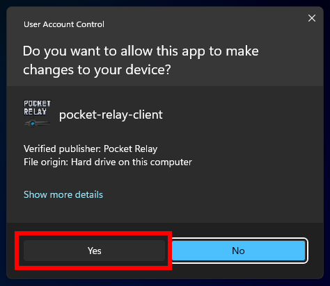
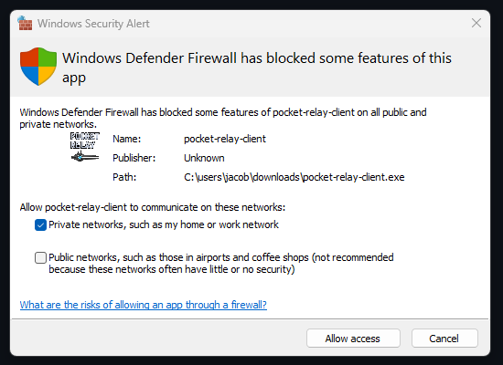

import WindowsIcon from "../../src/components/icons/WindowsIcon";
import Tabs from "@theme/Tabs";
import TabItem from "@theme/TabItem";

# Joining a server

Guide for joining Pocket Relay servers

If you have already downloaded **Pocket Relay Client** and patched your game before you can skip to [Connection URL](#4-connection-url)

:::info
This guide is for the **Pocket Relay Client** which is a tool that requires administrator privilleges to run, it also requires that you
keep the tool running while you play, There is an alternative ASI plugin version that doesn't require either of these you can find the
guide for using that at [Plugin Client](plugin-client.mdx)
:::

## Requirements

In order to run **Pocket Relay Client** you must have the following

- Windows 10 or newer
  - Client is untested on older versions but will likely run on Windows 7 and newer
- Administrator privilleges
  - In order to use the client you will need administrator privilleges
- Mass Effect 3 is closed
  - Pocket Relay must be running _before_ ME3 starts otherwise it will not work

## 1) Download client

Firstly, you must download the client program from one of the links below:

:::info
The _Windows Native_ version of the client listed below is a lightweight variant that uses less
resources and is smaller, however it is less aesthetically pleasing (RAM Usage: Normal ~30mb, Native ~3mb)
:::

| Variant                       | Link                                                                                                      |
| ----------------------------- | --------------------------------------------------------------------------------------------------------- |
| <WindowsIcon/> Windows        | [Download](https://github.com/PocketRelay/Client/releases/latest/download/pocket-relay-client.exe)        |
| <WindowsIcon/> Windows Native | [Download](https://github.com/PocketRelay/Client/releases/latest/download/pocket-relay-client-native.exe) |

:::tip
Make sure you keep this executable somewhere you will remember, as you will need to use this tool any time you want to connect to a Pocket Relay server
:::

The client program will automatically update, so you don't need to repeat this step when a new version is released

---

## 2) Starting the client

After you've downloaded the client, find the executable you've just downloaded and open it.

### Windows Administrator

Windows will prompt you _"Do you want to allow this app to make changes to your device?"_. This is because the current version of Pocket Relay requires modifying a system
file in order to redirect the game traffic see the [Client Technical Overview](../technical/client#hosts-file) to
see what is happening behind the scenes

To this prompt you must press **"Yes"** otherwise the app will not launch

:::info
The above screenshot is of the Windows 11 prompt, this may look slightly different on older versions of Windows
:::

### Windows Firewall

When launching the client for the first time you will see a message similar to the following from **Windows Defender Firewall** saying that it has blocked some features of the app.

This message appears because the client locally runs a server and Windows Firewall is preventing other devices on your network from accessing the client-side server _(This is okay and usually the ideal behavior for a Pocket Relay Client as theres no need for other devices on your network to access your client)_

For this prompt you can either press **"Cancel"** or **"Allow access"** as this has no affect on the client

:::info
This message will only appear when you launch the client for the first time, you shouldn't see it again
as Windows will remember your choice
:::

### Launched

After the above you should now see a window similar to the following:

import clientBaseImage from "./img/client-base.png";
import clientBaseNativeImage from "./img/client-base-native.png";

> As new versions are released the appearance may differ

<Tabs groupId="client-variant">
  <TabItem value="client" label="Client" default>
    </img>
  </TabItem>
  <TabItem value="client-native" label="Native Client">
    </img>
  </TabItem>
</Tabs>

:::tip
Click on the tab above to see the screenshot for your specific version
:::

## 3) Connection URL

In order to connect to a **Pocket Relay** server you must enter the "Connection URL" for the server into the input box.

Enter your server connection URL into this box (You should have been provided this by the person running the server you are trying to connect to). If you
are running your own server refer to the [Connection URL](../server/executable#4-connection-url) section in the server documentation for how to find it.

import clientUrlImage from "./img/client-url.png";
import clientUrlNativeImage from "./img/client-url-native.png";

<Tabs groupId="client-variant">
  <TabItem value="client" label="Client" default>
    </img>
  </TabItem>
  <TabItem value="client-native" label="Native Client">
    </img>
  </TabItem>
</Tabs>

After you have entered the server connection URL into the box press the **"Set"** button and you should connect to the server.

## 4) Done

After pressing "Set" the Pocket Relay Client should now show a "Connected: " message under the URL box this means you're now
connected and you can go start **Mass Effect 3** to play on the server.

import clientConnectedImage from "./img/client-connected.png";
import clientConnectedNativeImage from "./img/client-connected-native.png";

<Tabs groupId="client-variant">
  <TabItem value="client" label="Client" default>
    </img>
  </TabItem>
  <TabItem value="client-native" label="Native Client">
    </img>
  </TabItem>
</Tabs>

:::tip
If you are using an "Unofficial" copy of the game you should also check out the [Unlinked Accounts](unlinked-accounts.md) guide
:::
