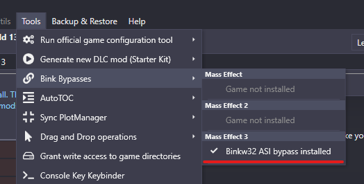

import WindowsIcon from "../../src/components/icons/WindowsIcon";
import Tabs from "@theme/Tabs";
import TabItem from "@theme/TabItem";

# Joining a server

Guide for joining Pocket Relay servers

## Requirements

In order to run **Pocket Relay Client** you must have the following

- Windows 10 or newer
  - Client is untested on older versions but will like run on Windows 7 and newer
- Administrator privilleges
  - In order to use the client you will need administrator privilleges

:::tip Experimental Version
If you are **NOT** able to use administrator privilleges on your device there is an experimental version of the client named _Embedded Client_ which doesn't require admin privilleges you can view the documentation for it [Here](./embedded-client)
:::

## 1) Download client

Firstly, you must download the client program from one of the links below:

:::info
The _Windows Native_ version of the client listed below is a lightweight variant that uses less
resources which may be more ideal for lower end computers. This alternative version uses 3mb of RAM
instead of the 30mb that the normal version uses however it is less aesthetically pleasing
:::

| Variant                       | Link                                                                                                      |
| ----------------------------- | --------------------------------------------------------------------------------------------------------- |
| <WindowsIcon/> Windows        | [Download](https://github.com/PocketRelay/Client/releases/latest/download/pocket-relay-client.exe)        |
| <WindowsIcon/> Windows Native | [Download](https://github.com/PocketRelay/Client/releases/latest/download/pocket-relay-client-native.exe) |

:::tip
Make sure you keep this executable somewhere you will remember, as you will need to use this tool any time you want to connect to a Pocket Relay server
:::

The client program will automatically update, so you don't need to repeat this step when a new version is released

---

## 2) Starting the client

After you've downloaded the client, find the executable you've just downloaded and open it.

### Windows Administrator

Windows will prompt you _"Do you want to allow this app to make changes to your device?"_. This is because the current version of Pocket Relay requires modifying a system
file in order to redirect the game traffic see the [Client Technical Overview](../technical/client) to
see what is happening behind the scenes

To this prompt you must press **"Yes"** otherwise the app will not launch

:::info
The above screenshot is of the Windows 11 prompt, this may look slightly different on older versions of Windows
:::

### Windows Firewall

When launching the client for the first time you will see a message similar to the following from **Windows Defender Firewall** saying that it has blocked some features of the app.

This message appears because the client locally runs a server and Windows Firewall is preventing other devices on your network from accessing the client-side server _(This is okay and usually the ideal behavior for a Pocket Relay Client as theres no need for other devices on your network to access your client)_

For this prompt you can either press **"Cancel"** or **"Allow access"** as this has no affect on the client

:::info
This message will only appear when you launch the client for the first time, you shouldn't see it again
as Windows will remember your choice
:::

### Launched

After the above you should now see a window similar to the following:

import clientBaseImage from "./img/client-base.png";
import clientBaseNativeImage from "./img/client-base-native.png";

> As new versions are released the appearance may differ

<Tabs>
  <TabItem value="client" label="Client" default>
    </img>
  </TabItem>
  <TabItem value="client-native" label="Native Client">
    </img>
  </TabItem>
</Tabs>

:::tip
Click on the tab above to see the screenshot for your specific version
:::

## 3) Patch Game

:::note
If you are using ME3 Tweaks Mod Manager and have the Bink Bypass for Mass Effect 3 already then you
can skip this step

> ME3 Tweaks Mod Manager Bink Bypasses

:::

You only need to do this step when you are first setting up, the patch will stick around until you remove it manually or using the **"Remove patch"** button.

In order for Mass Effect 3 to communicate with Pocket Relay you will need to patch your game using
a Binkw32 Bypass for an explaination behind this see the [Client Technical Overview](../technical/client)

To get started push the **"Patch"** button below:

import clientPatchImage from "./img/client-patch.png";
import clientPatchNativeImage from "./img/client-patch-native.png";

<Tabs>
  <TabItem value="client" label="Client" default>
    </img>
  </TabItem>
  <TabItem value="client-native" label="Native Client">
    </img>
  </TabItem>
</Tabs>

After pushing the **Patch** button Windows will open a file picker (This may look slightly different depending on your version of Windows)

With this file picker window you should browse to your **Mass Effect 3** game folder and find the **MasseEffect3.exe** file.

:::tip
This file should be at `{YOUR GAME FOLDER}/Binaries/Win32/MasseEffect3.exe`.
:::

Once you've found the file select it and press **"Open"**

After this you should have a pop-up window appear saying "Sucessfully patched game". You can press **"Ok"** on this message to dismiss it

## 4) Connection URL
