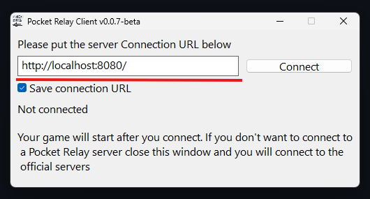

# Plugin Client

This is an alternative client version which is provided in the form of an ASI plugin. This version
does **NOT** require administrative privilleges like the normal client

Once you have applied to plugin to your game a window will appear every time your game starts:

With this window you can enter the Connection URL of the server that you want to connect to then

:::info
When using the **Plugin Client** you do **NOT** need to remove the plugin if you want to play on the official servers, instead
if you don't want to connect to a **Pocket Relay** server you can simply ignore/close the window that pops up
:::

Once you are connected a server you can freely close the popup window and continue playing like normal

---

## 1) Patching

In order to use the plugin client your game must be patched with a "Bink Bypass", below are guides for patching either [Manually](#manual) or using [ME3 Tweaks Mod Manager](#me3-tweaks-mod-manager).

:::info
If you have already previously patched your game using **Pocket Relay** client, manually, or using some other tool you can skip
to [3) Download plugin](#3-download-plugin)
:::

### ME3 Tweaks Mod Manager

If you are using ME3 Tweaks Mod Manager you can find the patch under the "Tools > Bink Bypasses" menu make
sure that the checkbox under **Mass Effect 3** is checked:

> Before Patching

> After Patching

Once your game is patched you can continue this guide from [3) Download plugin](#3-download-plugin)

---

### Manual

If you would like to apply the patch manually you can follow this guide:

#### 1) Download Patch

First you must download the patch from file from the link below

[Download binkw32.dll](https://github.com/PocketRelay/Client/raw/master/src/resources/binkw32.dll)

#### 2) Swap game binkw32.dll

Once you have downloaded `binkw32.dll` from the link open the folder that your `MassEffect3.exe` is in. It should
look similar to the following:

> Unpatched game folder

In this folder there should be a file named `binkw32.dll`

:::caution IMPORTANT

Take note of the file names `binkw32.dll` and `binkw23.dll` as they look similar but are different, one is 32 and one is 23. You must follow this guide exactly using the correct file names otherwise the patch will not function.

:::

:::info
If you already have a file named `binkw23.dll` **AND** `binkw32.dll` your game is likely already patched and you don't need to continue the patching guide
:::

Rename the file named `binkw32.dll` to `binkw23.dll` (Ensure the naming is exact as it is important). Once you have renamed the file you can move the `binkw32.dll` file that you downloaded in [1) Download Patch](#1-download-patch) into the same folder as `binkw23.dll`

:::note
If you have accidentally deleted your original `binkw23.dll` you can download it again from [Here](https://github.com/PocketRelay/Client/raw/master/src/resources/binkw23.dll)
:::

---

## 3) Download plugin

Once you've patched your game you can download the client plugin:

[Download](https://github.com/PocketRelay/PocketRelayClientPlugin/releases/latest/download/pocket-relay-plugin.asi)

## 4) Adding plugin

Once you've download the plugin head over to the folder containing `MassEffect3.exe` which should look similar to the following

> If you haven't added any other plugins previously then you might not have the "asi" folder

If your folder **doesn't** contain a `asi` folder you will need to create a new folder, ensure that you name it `asi` (Exactly)

Place the `pocket-relay-plugin.asi` file that you have downloaded into the `asi` folder

:::caution IMPORTANT

Ensure that you do **NOT** rename `pocket-relay-plugin.asi` to anything else as renaming the file will break the auto updating and will cause
issues if you try to update the plugin

:::

All done, you can now start Mass Effect 3 and you will see the **Pocket Relay** window appear

## 5) Connecting

When you next start Mass Effect 3 you will see the following window appear:

Enter your server connection URL into this box (You should have been provided this by the person running the server you are trying to connect to). If you
are running your own server refer to the [Connection URL](../server/executable#4-connection-url) section in the server documentation for how to find it.

Once you've entered the Connection URL press the **"Connect"** button to connect to the server

:::caution
Make sure you connect to a server **BEFORE** you press any key to continue on the following screen:

If you don't connect to a server before pressing any key you will connect to the official servers instead
:::

## 6) Done

Once you connect the the server you should see the following:

At this point you are now connected to the server and can play the game normally. Once you are connected to a server you can close the "Pocket Relay Client Plugin" window

:::tip Official servers
If you would like to play on the official servers you don't need to remove this plugin, simply don't connect to a server and you will be connected to the official servers instead
:::

:::tip
If you are using an "Unofficial" copy of the game you should also check out the [Unlinked Accounts](./unlinked-accounts) guide
:::
