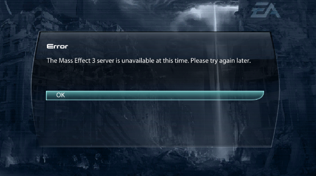
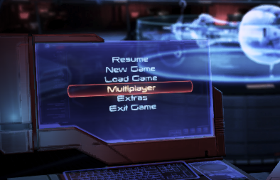
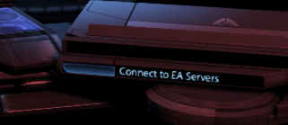
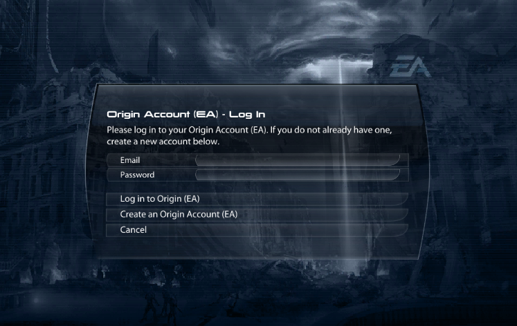
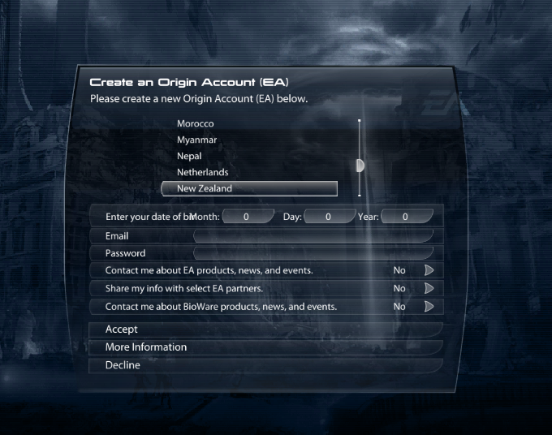
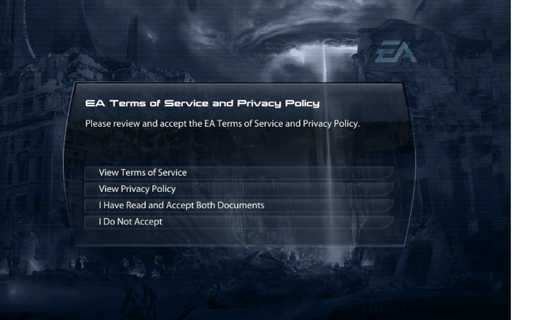
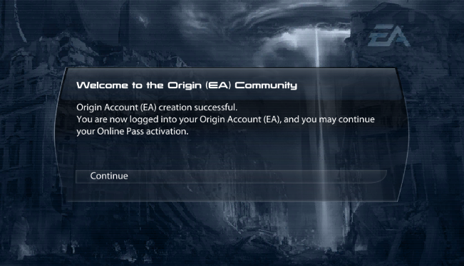

# Unlinked Accounts

Creating an unlinked account in-game

When using an Unlinked copy whether it be because you've followed [Origin Unlinking](./origin-unlinking.md) or because you're using an "Unofficial" copy of the game this guide shows creating and logging into accounts in-game 

## Initial Error

When opening the game with an unlinked copy you'll likely see the following error message:

This is caused by the game attempting to login to the server using credentials that are meant for the official server. These credentials wont work which causes an error.
You can simply press **"OK"** to close this error message after which you will be taken to the Main Menu

:::note
This error message may appear several times, you will simply have to press "OK" to the message as this is not something
that can be fixed on the server
:::

## Login screen

Once you're on the main menu screen you can push one of the following buttons to open the login prompt

after pushing one of the buttons the following login screen should appear, if you've already created an account you can use this screen to login using the email and password of the account you created:

If you don't already have an account on the server you can press the **"Create an Origin Account (EA)"** button

## Create Screen

After clicking the **"Create an Origin Account (EA)"** button you should see the following screen, here you can enter the credentials for
your new account and then press **"Accept"** to create your account

After pressing **"Accept"** you will be taken to a screen that asks you to accept the **"EA Terms of Service and Privacy Policy"** for
Mass Effect 3, you must accept the terms using **"I Have Read and Accept Both Documents"** in order to create an account

After accepting the above, you will see the following message, this indicates your account is created and you can push the **"Continue"** button and depending
on which multiplayer button you pushed earlier you will either be taken directly to the multiplayer screen of you will be taken back to the menu where you are 
now authenticated:

