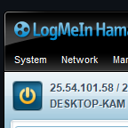

# Configuration

Configure your server 

:::note
**Every**time you change the configuration you must restart the server before the changes will be applied
:::

:::info
The server configuration is loaded from a file named **config.json** this file is in the same folder as the server executable **NOT** the data folder.
:::

This configuration file will **NOT** be created for you. You will have to manually create the config.json file on your own.

:::tip
You can now generate a config using the [Configuration Builder](./configuration-builder.mdx) tool rather than typing out the options manually
:::

## Default Configuration

Below is the default configuration, you can omit any of the fields below from the configuration and their default values will be used instead

:::info
You can find all the descriptions for each of the configuration options under this section
:::

```json title=config.json
{
  "host": "0.0.0.0",
  "port": 80,
  "reverse_proxy": false,
  "dashboard": {
    "super_email": "",
    "super_password": "",
    "disable_registration": false
  },
  "menu_message": "<font color='#B2B2B2'>Pocket Relay</font> - <font color='#FFFF66'>Logged as: {n}</font>",
  "galaxy_at_war": {
    "decay": 0.0,
    "promotions": true
  },
  "logging": "info",
  "retriever": {
    "enabled": true,
    "origin_fetch": true,
    "origin_fetch_data": true
  },
  "tunnel": "stricter",
  "api": {
    "public_games": false,
    "public_games_hide_players": true
  }
}
```

---

## Environment Variable

The server supports the `PR_CONFIG_JSON` environment variable which you can use to directly pass in the server configuration JSON through an environment variable

:::note
This variable accepts the raw JSON and not a path to a file. i.e the following

```env
PR_CONFIG_JSON={"port": 80}
```
:::

---

## Server Host

> Requires upcoming server version v0.5.11

The server host property configures which address the server will listen for connections on, by default 
the server will listen for connections on any interface using 0.0.0.0, you can change this by specifying
the specific IP to listen on.

```json 
{
  "host": "0.0.0.0"
}
```

---

## Server Port

The server port property configures which port the server will be running on

```json 
{
  "port": 80
}
```

The server port can be any number between 1 and 65536,

:::caution
Using any server port below 1024 on Linux will require that you launch the server using sudo
:::

:::note
Changing this port will require that you specify the port in both the Connection URL and when accessing the dashboard from the browser 
:::

---

## Reverse Proxy

This property configures whether the server is behind a reverse proxy or not. If you are using
a reverse proxy you should set this to `true`. If you don't set this to `true` and you are using
a reverse proxy clients will **NOT** be able to connect to each other

```json 
{
  "reverse_proxy": false
}
```

---

## QoS

> QoS configuration is only present in server v0.5.10 and above

This property configures the QoS server that the game will use

:::info
This is important if you are hosting a **WAN** server as some users may not be able
to connect to each-other if you don't use the "official" QoS servers due to a current
server limitation
:::


### Official

Specifying the "qos" configuration below will tell clients to use the official QoS server, you will
likely want to use this option if you are hosting a **WAN** server (Theres no reason to use the official server if you are hosting a **LAN** or **Extended LAN** network) 

Using the official QoS server fixes a bug that prevents some players from joining each other on your server.

```json
{
  "qos": {
    "type": "official"
  }
}
```

### Local

Specifying the "qos" configuration below will tell clients to use the built in QoS server. This works if you are only hosting a **LAN**/**Extended LAN** server, if you are creating a **WAN** server you should use the [Official](#official) QoS server instead

```json
{
  "qos": {
    "type": "local"
  }
}
```
### Custom

Specifying the "qos" configuration below will tell clients to use the provided custom QoS server. This is undocumented and only added for future use or a fallback if the official server address becomes unavailable

```json
{
  "qos": {
    "type": "custom",
    "host": "example.com",
    "port": 17899
  }
}
```

### Disabled

> Requires upcoming server version v0.5.11

Specifying the "qos" configuration below will tell clients not to use a QoS server at all. This will disable public IP address resolution and can be good if you're only playing locally and don't want clients to resolve their public addresses

```json
{
  "qos": {
    "type": "disabled"
  }
}
```

### Hamachi

> Requires upcoming server version v0.5.11

Specifying the "qos" configuration below will treat the networking of clients as one which is within a Hamachi virtual network. You cannot use this option if you want anyone to connect from outside hamachi as they won't be able to join other players.


```json
{
  "qos": {
    "type": "hamachi",
    "host": "25.54.101.58"
  }
}
```

:::info
Set the "host" field to be the Hamachi virtual address, visible for the person hosting the Hamachi network (They also need to be running the server), specifically the
**IPv4** address **NOT** the IPv6 *(IPv6 is not supported by Pocket Relay)*


:::


## Dashboard

```json
{
  "dashboard": {
    "super_email": "example@example.com",
    "super_password": "password",
    "disable_registration": false
  }
}
```

### Super Admin

For the administrative portion of Pocket Relay (Editing inventories and managing players), you need to assign a "Super Admin" account, this account is capable of managing the server with access to server logs and such, the Server Admin can then give out "Admin" role to other players on the server which is a role with slightly less permissions.

:::info
Super admins are **NOT** separate accounts, they use the accounts that are created on the server so you must either create an account in-game or through the dashboard, in order for the server to give them super admin.
:::

:::info
The super admin role is checked and assigned every time the server restarts and when accounts are created 
:::

#### Super Email 

The super email field is used to set the email of the account that should be given the super admin role:

```json
{
  "dashboard": {
    "super_email": "example@example.com"
  }
}
```

#### Super Password

This field is optional but it's helpful if you are using an **Origin** account for your **Super Admin** as **Origin** accounts don't have any password unless one is set through the dashboard. This property assigns the password of the **Super Admin** to the provided password:

```json
{
  "dashboard": {
    "super_password": "password"
  }
}
```

:::info
If the account already exists the password will be applied the next time the server restarts, otherwise it will be applied when the account is created
:::

:::warning
If you don't want to use this then remove the field from your JSON config entirely, don't set it to blank as that will simply assign the user a blank password. (This has been fixed in a yet to be released version so is a problem for now)
:::

### Disable account registration

You can use this property to disable registering accounts through the dashboard (Only allow player to create account in-game) this can be useful if you are running a public server and don't want people who aren't using the server creating accounts

The default for this is `false` which allows users to create accounts through the dashboard. Setting this to `true` will prevent this behavior.

```json
{
  "dashboard": {
    "disable_registration": false
  }
}
```

---

## Menu Message

The menu message configuration contains the message that will be displayed on the Main Menu within Mass Effect 3.

```json
{
  "menu_message": "<font color='#B2B2B2'>Pocket Relay</font> - <font color='#FFFF66'>Logged as: {n}</font>"
}
```

The menu message can make use of the font element to change the color of the text contained with. This uses hex color codes

```html
<font color="#FFFFFF">Something</font>
```

The menu message also has some placeholder variables that you can use. The server will replace the placeholders before sending the message to the client

| Placeholder | Description               |
| ----------- | ------------------------- |
| `{v}`       | The server version number |
| `{n}`       | The player account name   |

---

## Galaxy At War

```json
{
  "galaxy_at_war": {
    "decay": 0.0,
    "promotions": true
  }
}
```

### Daily Decay

In the default server configuration your Galaxy At War progress will not decay at all, this is because “decay” is set to 0.0 which doesn’t decay at all.

:::info Example
0.5 = -1% for each galaxy at war area over each day passed that the player wasn’t active for
:::

Setting this to 0.0 will prevent any decay from happening


```json
{
  "galaxy_at_war": {
    "decay": 0.0
  }
}
```

### Include Promotions

This property determines whether your total character promotions is included as a Galaxy At War asset:

```json
{
  "galaxy_at_war": {
    "promotions": true
  }
}
```

---

## Logging

This logging configuration tells the server what level of logging it should show in both the log file and the program output.

```json
{
  "logging": "info"
}
```

:::tip
For normal usage you should ideally leave the server in "info" logging mode, as the "debug" mode can cause the server log file to become quite large.
:::

:::caution
Server log files can contain personal access tokens, so it is recommend you do **NOT** post them publicly anywhere, only sharing them with
the **Pocket Relay** developer if you need to debug an issue
:::

The server log file is stored in the following file:

```
data/server.log
```

The following is a list of available logging levels 

:::info
Every level inherits all the logging from the level below it i.e debug inherits all logging from info and warn
:::

| Level | Description                                            |
| ----- | ------------------------------------------------------ |
| debug | Shows all logging including debug messages             |
| info  | Shows informational logging, warning and error logging |
| warn  | Only shows warning and error logs                      |
| error | Only shows error logs                                  |
| off   | Doesn’t show any logs                                  |

---

## Retriever

The retriever section contains settings for how the server will handle needing to reach out to the official servers for data

```json
{
  "retriever": {
    "enabled": true,
    "origin_fetch": true,
    "origin_fetch_data": true
  }
}
```

### Enabled

:::caution
If you disable this setting players using an **Origin** account will not be able to connect to your server without [Unlinking from Origin](../client/origin-unlinking)
:::

This setting determines whether fetching data from the official servers is allowed or not. Setting this to false will disable both [Origin Fetch](#origin-fetch) and [Origin Fetch Data](#origin-fetch-data)

```json
{
  "retriever": {
    "enabled": true
  }
}
```

### Origin Fetch

:::caution
If you disable this setting players using an **Origin** account will not be able to connect to your server without [Unlinking from Origin](../client/origin-unlinking)
:::

This setting determines whether the server is allowed to use the official server to authenticate **Origin** accounts. 

```json
{
  "retriever": {
    "origin_fetch": true,
  }
}
```

### Origin Fetch Data

This setting determines whether the server should also fetch and copy over the player data of **Origin** accounts when creating them for the first time.

The player data is only copied over when the account is first authenticated, future logins won’t cause the data to be loaded account.

```json
{
  "retriever": {
    "origin_fetch_data": true
  }
}
```

---

## Tunnel

> New server connection tunneling is included in server version >= v0.6.0-beta and client version >= 0.4.0
> for details about tunneling see https://github.com/PocketRelay/Server/issues/64

Server network tunneling allows the clients to tunnel the game connection through the server by using the server
as a relay. This is enabled by default and set to "Stricter". Tunneling helps to avoid common pitfalls and connection
issues that are encountered with stricter NATs

### Stricter

Using the "stricter" option will only tunnel connections when they are of a NAT type stricter than "Open" which is the 
best default as people playing with "Open" NAT get the best latency from having a direct connection and those who have
a stricter NAT who aren't normally able to play are now able to play

```json
{
  "tunnel": "stricter"
}
```

### Always

This option *always* tunnels connections through the server. This can be good if you're looking to increase user privacy
since it will hide the IP address of hosts from other players (They are normally exposed on the official servers), at the
cost of additional latency that "Open" NAT players might not normally get

```json
{
  "tunnel": "always"
}
```

:::info
When using this option you can choose to disable the QoS server entirely as it is not used when
tunneling is forced
:::

### Disabled

This option disabled tunneling, using this option may prevent those with stricter NATs from hosting games entirely

```json
{
  "tunnel": "disabled"
}
```

---


## API

The API section handles various API related configurations


```json
{
  "api": {
      "public_games": false,
      "public_games_hide_players": true
  }
}
```

### Public games API

Normally, the games API at `/api/games` requires an authentication token to get the list of games. With this
you can disable that requirement and allow the games list to be requested without requiring authentication.

By default players are hidden from the games response when not authenticated but you can get the total players in the
game using the `total_players` field in the response for each game. 

To include players in authenticated responses see [Hide players from public games](#hide-players-from-public-games)

This option is likely useful if you want to create a discord bot or some other display that doesn't want to deal with auth

```json
{
  "public_games": false
}
```

### Hide players from public games

This option is enabled by default, it controls whether the player list should be hidden from unauthenticated requests to the games API. When `true` the list of players provided by the games API will be `null`. 


```json
{
  "public_games_hide_players": true
}
```

:::warning
This is done for privacy purposes. Accounts created using the in-game account creation screen prior to `v0.6.1` of Pocket Relay would use
their email address as the player name so any accounts that have not changed their username for these sorts of accounts will expose their
email in this response (Origin accounts and those created/changed through the dashboard are not affected)

If your database doesn't contain any of these types of accounts or if it was created with `v0.6.1` or greater (Random name generation was added in `v0.6.1` for in-game account creation) and you don't mind people seeing the names of who's in a game then you can set this to `false` to include the players list
:::