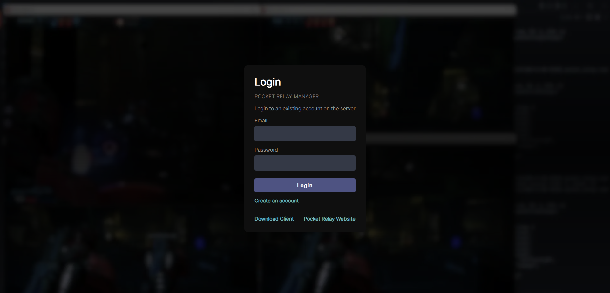
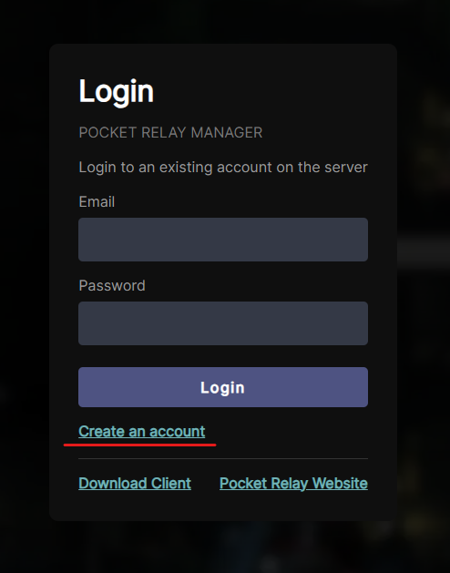
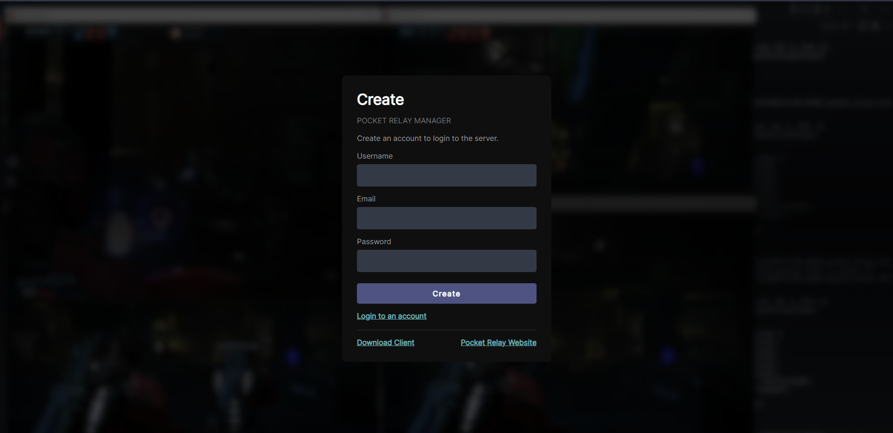

# Dashboard

Information and guide relating to the server dashboard

## Visiting the dashboard

You can visit the dashboard using the Connection URL, the dashboard is publicly accessible for all users. If you are the
server hoster you can find the Connection URL using the [Connection URL](./2-executable.mdx#4-connection-url) section in the server documentation

Upon your first visit, you'll encounter the login screen described in [Logging into an Account](#logging-into-an-account).

## Logging into an account

Upon visiting the dashboard, you'll encounter the following login screen:

The dashboard uses the same password as your in-game account. If you've already created an account in-game with an [Unlinked Account](../client/9-unlinked-accounts.md), you can log in using the password you've set up.

:::note
If you are using an **Origin** account, it won't have a default password. If you are the server owner follow the [Super Admin Password](4-configuration.md#super-password) to set up a super-admin and password for your account. If you are not the server owner, someone with admin/super-admin permissions needs to set a password through the dashboard, which you can later change.
:::

## Creating an account

Creating an account through the dashboard can be disabled in the server configuration

:::caution
If you use Origin data fetching to load your progress from the official server, do **NOT** create your account through the dashboard. Instead, launch the game first and let the game create the Origin account automatically. After the game creates your account, follow the note in the logging-in guide about Origin accounts.
:::

You can create an account from the dashboard page by clicking the "Create an account" link on the login page:

Clicking the link will take you to the following page, where you can enter the details for your new account:

## Admin permission

By default, **Normal** users accessing the dashboard have read-only permissions for most things. This means they can:
- View server basic details like total players, server version
- View N7 & Challenge point leaderboards
- View their current inventory contents 
- View their class levels and promotions
- View on-going games 
- Change their username and email
- Change their password
- Delete their account

If you want to manage player accounts, player inventories, and additional permissions, you will need an admin account.

If you are the owner of the server you should give your account the super-admin role, this is the highest role available and allows full control over the server. You can use your super-admin account to give admin permissions to other accounts to allow them to do similar actions.

To setup a super admin account follow: [Super Admin](4-configuration.md#super-admin)

**Admins** can:
- Do everything normal users can
- Edit their inventory and other player inventories
- Edit their class level and other player classes
- Change passwords, usernames, and emails for other accounts
- Clear a player user data, import and export user data
- View the list of player accounts
- Get an expanded view of games showing extra information

**Super admins** can:
- Do everything admin users can
- Set roles of other accounts (Can make users admin)
- View, download, and clear the server logs