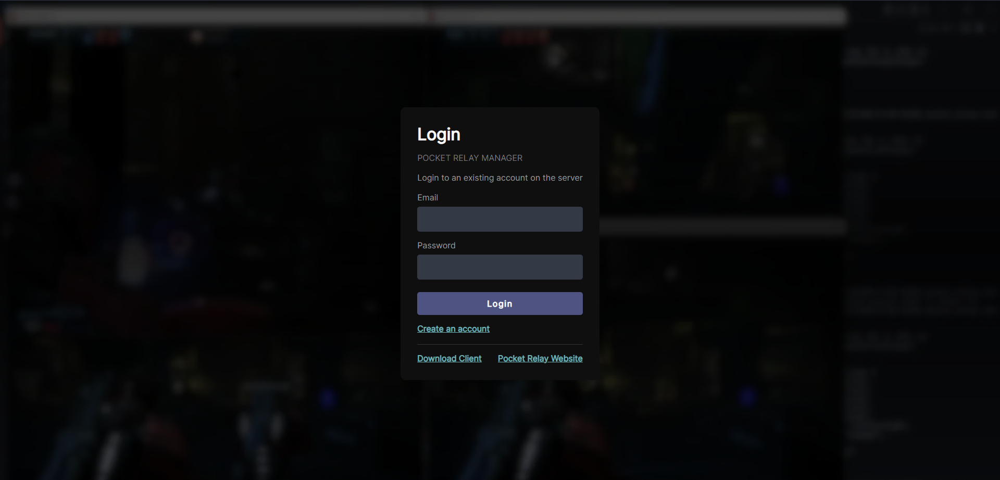
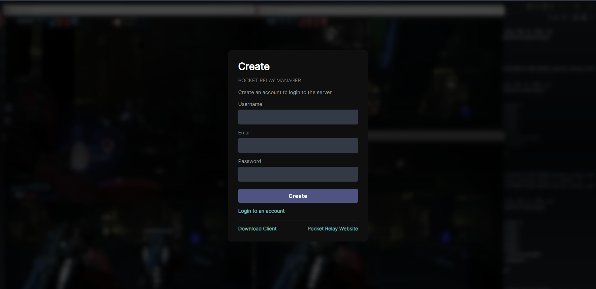

# Dashboard

Information and guide relating to the server dashboard

## Visting the dashboard

You can visit the dashboard using the Connection URL, the dashboard is publicly accessible for all users. If you are the
server hoster you can find the Connection URL using the [Connection URL](executable#4-connection-url) section in the server documentation

When you visit the dashboard for the first time you should see the login screen from [Logging into an account](#logging-into-an-account)

## Logging into an account

When visiting the dashboard you can see the following login screen:

The dashboard uses the same password as your in-game account

If you've already created an account in-game with an [Unlinked Account](../client/unlinked-accounts.md) then you can login using the 
password that you've setup.

:::note

If you are using an **Origin** account by default your account will not have a password set so you will not be able to access the dashboard.
If you are the server owner you can follow the [Super Admin Password](configuration.md#super-password) guide to setup super-admin and a password for your account. 

If you are not the server owner someone with admin/super-admin permissions will need to set you a password through the dashboard which you will be able to change yourself later on.
:::

## Creating an account

:::caution

If you are using Origin data fetching to have your progress loaded from the official server, do **NOT** create your account through the dashboard. 
If you create your account through the dashboard your progress will **NOT** be loaded from the official server, instead launch the game first and let the
game create the Origin account automatically.

Once the game has created your account automatically then follow the note in logging-in guide about Origin accounts

:::

You can create an account from the dashboard page by pressing the "Create an account" link on the login page:

Clicking the link will take you to the following page, where you can enter the details for your new account:

## Admin permission

By default **Normal** users accessing the dashboard will have read-only permissions for most things, this means they can only do the following:

- View the server basic details like total players, server version
- View N7 & Challenge pointer leaderboards
- View their current inventory contents 
- View their class levels and promotions
- View on-going games 
- Change their username and email
- Change their password
- Delete their account

If you want to be able to manage player accounts, player inventories, and additional permissions you will need an admin account.

If you are the owner of the server you should give your account the super-admin role, this is the highest role available and allows full control over the server. You can use your super-admin account to give admin permissions to other accounts to allow them to do similar actions.

To setup a super admin account follow: [Super Admin](configuration.md#super-admin)

**Admins** can do the following:
- Everything normal users can do
- Edit your inventory and other player inventories
- Edit your class level and other player classes
- Change passwords, usernames, and emails for other accounts
- Clear a player user data, import and export user data
- View list of player accounts
- Expanded view of games showing extra information

**Super admins** can do the following:
- Everything admin users can do
- Set roles of other accounts (Can make users admin)
- View, download and clear the server logs

