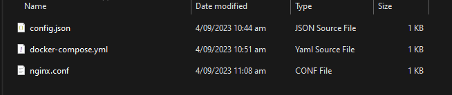

# Docker

Create a server that runs within a Docker container

## Docker Image

**Pocket Relay** ships a minimal alpine linux docker image that downloads and runs the server. This image is

```
jacobtread/pocket-relay:latest
```

The Dockerfile used for this image can be found in the server repository [Here](https://github.com/PocketRelay/Server/blob/master/Dockerfile)

:::caution
You **MUST** create a config.json file before you run any of these docker script as otherwise you will run into an error where
docker creates a folder named "config.json" rather than binding the to file.

See [Configuration](./configuration) for a default configuration
:::


## Docker Compose

The following docker-compose file will bind the config.json and data folder for Pocket Relay to the same directory that the server
is running in. As mentioned in the caution note make sure that config.json exists in the same folder as this docker-compose.yaml file.

```yml title=docker-compose.yml
version: "3"
services:
  pocket-relay:
    container_name: pocket-relay
    restart: unless-stopped
    ports:
      # Server port
      - 80:80/tcp
    image: jacobtread/pocket-relay:latest
    volumes:
      # Bind the server config to a local config.json file
      - ./config.json:/app/config.json
      # Binding the server data to a local data folder
      - ./data:/app/data
```

Once you've created the above docker-compose.yml file you can use the following command to start the container

```shell
docker-compose up
```

If you change the server port in the config.json file make sure to change the docker-compose file port exposing
```yml
  ports:
    # Server port
    - {NEW PORT}:{NEW PORT}/tcp
```

## Docker Compose Reverse Proxy

Below is an example using Docker Compose with a reverse proxy in-front of the server (This example is using Nginx)

:::caution
Make sure to create all the files below before running `docker-compose up`
:::

First is creating the docker-compose.yaml file

```yml title=docker-compose.yml
version: "3"
services:
  # The Pocket Relay server
  server:
    restart: unless-stopped
    container_name: pocket-relay
    image: jacobtread/pocket-relay:latest
    volumes:
      # Bind the server config to a local config.json file
      - ./config.json:/app/config.json
      # Binding the server data to a local data folder
      - ./data:/app/data
  # The Nginx proxy container
  nginx:
    restart: unless-stopped
    image: nginx
    ports:
      - "80:80/tcp"
    volumes:
      - ./nginx.conf:/etc/nginx/nginx.conf:ro
    depends_on: 
      - server
```

Then creating the nginx.conf file to setup the nginx proxy 

```conf title=nginx.conf
events {}

http {
    server {
        # Listen for requests on port 80
        listen       80;

        server_name  localhost;

        location / {
            # Address pointing to the server container
            proxy_pass  http://server:80;
            
            # Provide server with real IP address of clients
            proxy_set_header X-Real-IP $remote_addr;

            # Upgrade websocket connections 
            proxy_set_header Upgrade $http_upgrade;
            proxy_set_header Connection "upgrade";
            proxy_http_version 1.1;
        }
    }
}
```

The server configuration file must be created in this same folder (If you haven't created one follow the [Configuration](./configuration) guide) and make sure the [Reverse Proxy](./configuration#reverse-proxy) property is set to `true`

Below is an example configuration that only changes the required setting:

```json title=config.json
{
  "reverse_proxy": true
}
```

After creating all the above files your folder should look like the following:



:::caution
Make sure you have created all of the files mentioned above, running the following command without
doing the above will likely cause a silent failure
:::


Once you've created the above docker-compose.yml file you can use the following command to start the container

```shell
docker-compose up
```


## Docker Run

You can directly create a server using the docker run command below. As mentioned in the caution note make sure that config.json exists in the same folder as you are running this command. The container will bind to the current folder you are in and will store the server data there

This version doesn't support locally binding a configuration file, so you will be stuck using the default configuration unless you use the docker compose example above:

```shell
docker run -d -p 80:80/tcp -v ./data:/app/data jacobtread/pocket-relay:latest
```


## Updating

In order to update the server version to the latest you can use the following command:

```shell
docker pull jacobtread/pocket-relay:latest
```