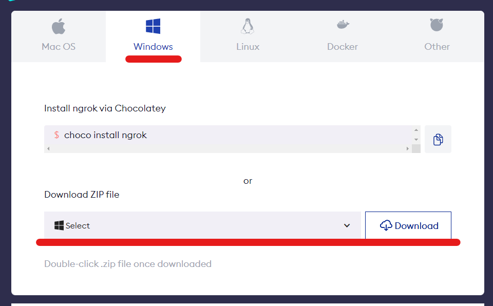

# Ngrok

Exposing the server to WAN through Ngrok

:::tip

If you want to allow Open NAT type users to bypass the tunneling then you should
set `reverse_proxy` mode in the server config. [Server Config Reverse Proxy](./configuration.md#reverse-proxy)

:::


If you are on a network where you can't directly expose the server or if you don't want to port forward, you can instead use `Ngrok` as a temporary reverse proxy. 

With ngrok you will be given a public HTTPS url that you can give to your friends like: `https://xxxx-xxx-xxx-xx-xx.ngrok-free.app`, they can
use this URL as the Connection URL and will be able to connect to you without requiring any additional setup such as port forwarding.

## Download Ngrok

You can download the ngrok agent tool from https://ngrok.com/download 

You can download zip containing the ngrok tool



## Extract Ngrok

Extract the downloaded zip file and you will have an ngrok.exe

## Start the server

Start the Pocket Relay server through the server executable 

## Open terminal

Open at terminal at the folder containing ngrok.exe, there are various ways of doing this choose
whichever method you're most familiar with


## Start Ngrok

Once you've got the terminal open you can run the following command to start ngrok:

```sh
ngrok http 80
```

After running this command you will be given a "Forwarding" URL (Underlined in red), this is the Connection URL you should provide to players:


