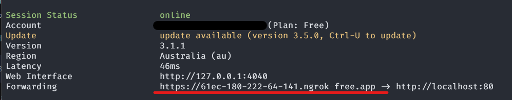

# Ngrok

Exposing the server to WAN through Ngrok

:::tip

If you want to allow Open NAT type users to bypass the tunneling then you should
set `reverse_proxy` mode in the server config. [Server Config Reverse Proxy](./configuration.md#reverse-proxy)

:::

:::tip
Ngrok is for more temporary setups and users who don't have access to their own domains. If 
you have access to your own domain [Cloudflare Tunnels](./cloudflare_tunnel.md) might be a better option 
for you.
:::


If you are on a network where you can't directly expose the server you can instead use `Ngrok` as a temporary reverse proxy. 
You will need a free account in order to do this. (https://ngrok.com/)

After installing the CLI tool and adding your authorization token you can run the following command:

```sh
ngrok http 80 
```

After running this command you will be given a "Forwarding" URL (Underlined in red), this is the Connection URL you should provide to players:




:::info
The upcoming tunneling networking changes will likely further improve the connectivity between players when
using this method
:::
