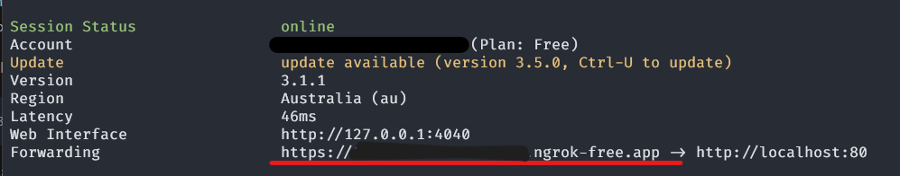

# Ngrok

Make sure you enable the `reverse_proxy` mode in the server configuration file. [Server Config Reverse Proxy](./configuration.md#reverse-proxy)

If you are on a network where you can't directly expose the server you can instead use `Ngrok` as a temporary reverse proxy. 
You will need a free account in order to do this. (https://ngrok.com/)

After installing the CLI tool and adding your authorization token you can run the following command:

```sh
ngrok http 80 --request-header-add='x-real-ip: ${.ngrok.client_ip}'
```

After running this command you will be given a "Forwarding" URL (Underlined in red), this is the Connection URL you should provide to players:




:::info
The upcoming tunneling networking changes will likely further improve the connectivity between players when
using this method
:::
