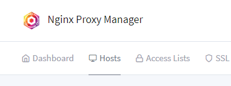
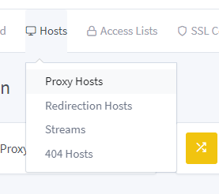
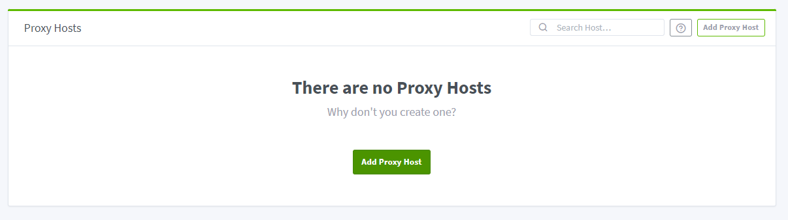
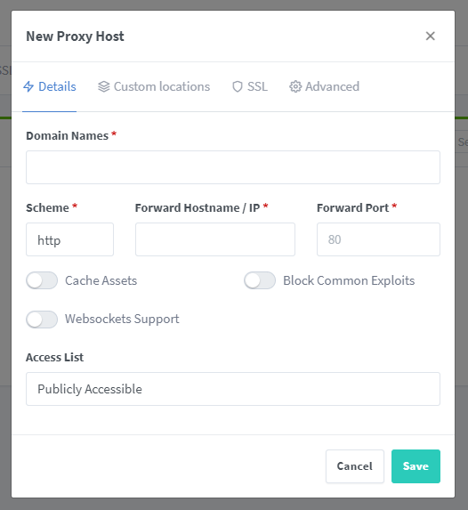
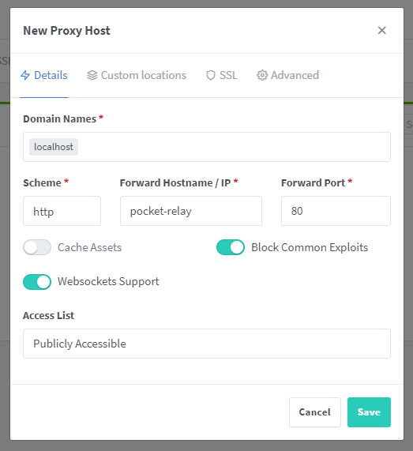
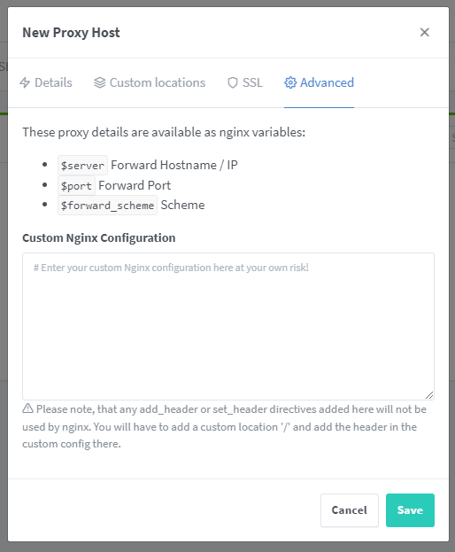
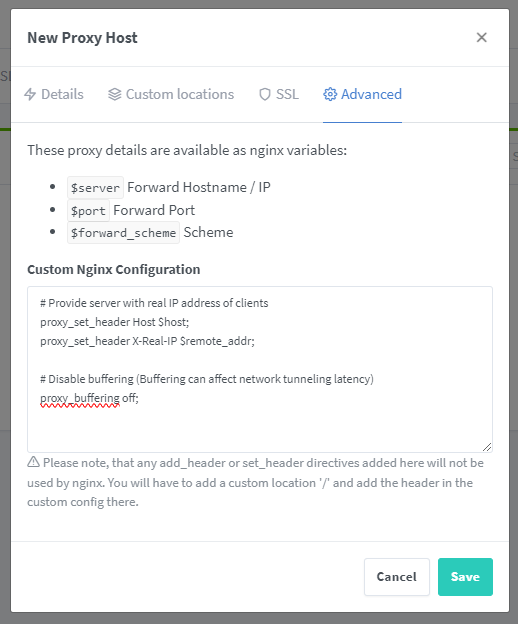

# Nginx Proxy Manager

This guide is for configuring Nginx Proxy Manager for use with Pocket Relay.

## Setup

When using a reverse proxy make sure you enable the `reverse_proxy` mode in the server configuration file. [Server Config Reverse Proxy](./4-configuration.md#reverse-proxy)

This guide only includes a more basic setup, if you are looking for a more advanced Nginx setup you can find the configuration details in [Nginx](./nginx.md)

### Creating the proxy

To create the proxy for your Pocket Relay server, press the "Hosts" button in the navigation bar of your Nginx Proxy Manager admin dashboard:



From the dropdown menu select the "Proxy Hosts" option: 



You will be taken to the list of proxy hosts that you have configured (In this example there are no other hosts). Press the "Add Proxy Host" button:




### Proxy Configuration

You should now see the "New Proxy Host" screen, this asks for some basic information:



For domain names, you should fill out any domains you plan on exposing Pocket Relay through. 

Scheme should be set to "http", you shouldn't need to change this unless you have a weird setup going on.

Set the "Forward Hostname / IP" to the IP address of your server.

Set the "Forward Port" to the port you are using for the server.

Make sure you enable the "Websockets Support" switch, this is required for Pocket Relay to function (You can find out more about this [Here](../../technical/client/connection-upgrading.md))

You will likely also want to enable "Block Common Exploits" to protect your server.

:::note
Out of the above mentioned only "Scheme", "Hostname / IP", "Forward Port", and "Websockets Support" are required. You're freely able to configure the other options 
on this page
:::

Below is an example (Here pocket-relay is used as the hostname as this is running under docker using the container name as the host for networking), this example uses "localhost" as the domain name:



After filling out the "Details" tab click on the "Advanced tab":



On this page you will want to copy the following configuration snipped and place it into the "Custom Nginx Configuration" text box:

```conf
# Provide server with real IP address of clients
proxy_set_header Host $host;
proxy_set_header X-Real-IP $remote_addr;

# Disable buffering (Buffering can affect network tunneling latency)
proxy_buffering off;
```

It should look like the following:



After pressing "Save" you should be good to go

:::note
This example doesn't include setting up SSL, you will need to do your own research for setting that up correctly. You do not need to change any Pocket Relay settings if you enable SSL
:::