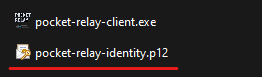

# Reverse Proxy

Learn how to configure a reverse proxy to work with Pocket Relay.


If you're utilizing a reverse proxy like [Nginx](https://nginx.org/en/), you'll need to adjust your server settings to enable HTTP Upgrades for Pocket Relay. The Pocket Relay Clients and server use HTTP Upgrades to connect game clients to the server (refer to [Technical Overview](../technical/client#connection-upgrading)). Most reverse proxies don't enable support for handling HTTP upgrades out of the box so this must be configured.

Currently, this guide provides examples for **Nginx** and **Traefik**. If you're using another proxy, suggest it on Discord or raise a GitHub issue to include an example.

:::caution 
If you are exposing your Pocket Relay server to the internet you are expected to have an existing understanding of cybersecurity and server hosting. This guide does not show you how to set up a secure/hardened setup; rather, it just shows you what is required to make your server work with Pocket Relay. You are expected to configure your servers properly yourself.

If you expose your Pocket Relay server to the internet, anyone with the Connection URL will be able to connect to it (unless you specifically prevent them with things such as firewalls or IP whitelisting on your server). 

If you would like to expose your server but only want authorized users to access it you can see the [Client Certificate Auth](#client-certificate-auth) section for how to use client certificates for cryptographic authentication.
:::

## Basic setup

When using a reverse proxy make sure you enable the `reverse_proxy` mode in the server configuration file. [Server Config Reverse Proxy](./configuration.md#reverse-proxy)


### Configuring Nginx

:::tip
If you are using the Nginx reverse proxy within Docker through docker-compose you can use the [Docker Compose Reverse Proxy](docker.md#docker-compose-reverse-proxy) example as a base for your setup
:::

:::info
You can find your Nginx configuration using the guide here: https://docs.nginx.com/nginx/admin-guide/basic-functionality/managing-configuration-files/
it will likely be present at `/etc/nginx/nginx.conf` 
:::

In order to support HTTP Upgrades and X-Real-IP in your Nginx config you'll need to add the following lines inside the location block for your Pocket Relay server:


```conf
# Provide server with real IP address of clients
proxy_set_header X-Real-IP $remote_addr;

# Upgrade websocket connections 
proxy_set_header Upgrade $http_upgrade;
proxy_set_header Connection "upgrade";
proxy_http_version 1.1;
```

Its also recommened that you disable proxy buffering in your nginx config for Pocket Relay. With the new tunneling system implemented in v0.6.0 the latency between players could be affected, greatly reducing your experience:

```conf
# Disable buffering (Buffering can affect network tunneling latency)
proxy_buffering off;
```

An example config using this is the following (This example is a modified version of the example found on https://www.nginx.com/blog/websocket-nginx/)

```conf

events {}

http {
    server {
        listen       80;

        server_name  localhost;

        location / {
            # Update this with the address and port to your Pocket Relay server 
            proxy_pass  http://server:80;
            
            # Provide server with real IP address of clients
            proxy_set_header X-Real-IP $remote_addr;

            # Upgrade websocket connections 
            proxy_set_header Upgrade $http_upgrade;
            proxy_set_header Connection "upgrade";
            proxy_http_version 1.1;

            # Disable buffering (Buffering can affect network tunneling latency)
            proxy_buffering off;
        }
    }
}

```

#### Sub directories


If you'd like to host the server within a subdirectory you can change the location portion to look like this:


```conf
location /test/ {
    # Remove the /test/ sub directory prefix from the url before it gets to the server
    rewrite /test/(.*) /$1 break;

    # ^..the other configuration from previous example
}

```

If you change the server sub directory in order for the dashboard to work you will need to recompile the dashboard sources
to use a different base url, you can do this by cloning the repository from https://github.com/PocketRelay/Dashboard, installing
the dependencies, then updating the `svelte.config.js` file like the following:

```js

import adapter from '@sveltejs/adapter-static';
import { vitePreprocess } from '@sveltejs/kit/vite';

/** @type {import('@sveltejs/kit').Config} */
const config = {
	// Consult https://kit.svelte.dev/docs/integrations#preprocessors
	// for more information about preprocessors
	preprocess: vitePreprocess(),

	kit: {
		adapter: adapter({
			fallback: "index.html"
		}),
		prerender: {
			entries: [],
		},
        // ADD THIS SECTION HERE
        paths: {
            // Replace /test with the sub directory you used above in nginx 
            base: "/test"
        }
	}
};

export default config;
```

Once you've updated the config you can build the dashboard sources. Then copy the built sources from the `build`
directory into a new folder name `public` in the server `data` folder (`data/public`) 


### Configuring Traefik

**Traefik** already supports the X-Real-IP header out of the box so you don't need to enable that, however you do need to enable Web Socket Support

## Client Certificate Auth

> Requires client version v0.2.8 or greater for the standalone tool, and version v0.0.4 or later for the asi plugin

When using a reverse proxy like Nginx you can force clients to provide a client "identity" to authorize using the server. This can be helpful if you want to expose your server but only want to allow certain people access to the server.

:::info
Client certificate auth also prevents users without the identity from accessing the dashboard (Unless manually configured to not), most modern browsers support choosing custom certificates so the solution to this should be as simple as importing the client identity.
:::

### Server Portion

The guide below shows a basic configuration with Nginx for enabling client certificate authorization. 

If you are using a different reverse proxy, or some other method of enabling client certificate authorization then you can skip to the [Client Portion](#client-portion)

:::caution
The guide below only contains the bare minimum configuration changes required, you are epxected to properly setup your Nginx configuration yourself
:::

```conf

events {}
http {
    server {
        # Basic TLS serving (You should configure these lines yourself properly)
        listen       443 ssl;
        ssl_certificate         /etc/nginx/server.crt;
        ssl_certificate_key     /etc/nginx/server.key;
        
        # Specify the client certificate
        ssl_client_certificate  /etc/nginx/client.crt;
        # Verify client certificates
        ssl_verify_client on;

        # ... other nginx configuration mentioned above
    }
}
```

The important lines from the above example are the following, you can alter the rest to your liking:

```conf
# Specify the client certificate
ssl_client_certificate  /etc/nginx/client.crt;
# Verify client certificates
ssl_verify_client on;
```

### Client Portion

Once your server is setup to verify client certificates you will need to provide a your client identity to everyone who
you would like to allow access to.

Every client will need to be provided a `pocket-relay-identity.p12` this file should be a PKCS#12 archive containing the client
certificate and private key, this archive must **NOT** have a password as the Pocket Relay client cannot handle password encrypted
identities.

You should place the `pocket-relay-identity.p12` file in the same folder as your `pocket-relay-client.exe`, like the following:




:::note
If you are using the asi plugin client version put the file next to your `MassEffect3.exe` instead
:::


Make sure your identity file is named exactly `pocket-relay-identity.p12` otherwise it will **NOT** be loaded.

The client will now use that identity when connecting to the server