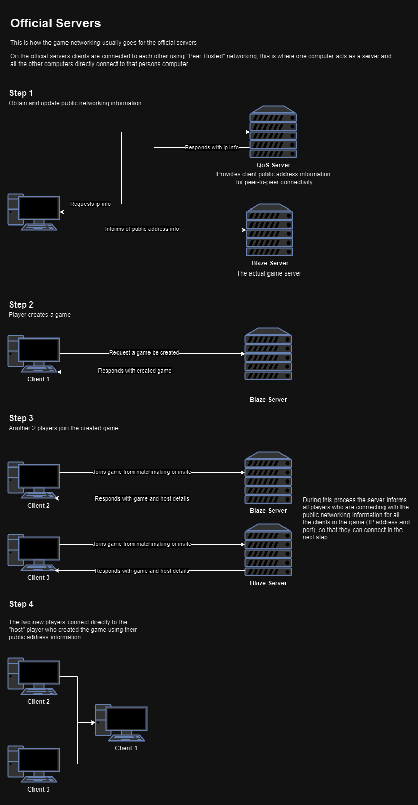
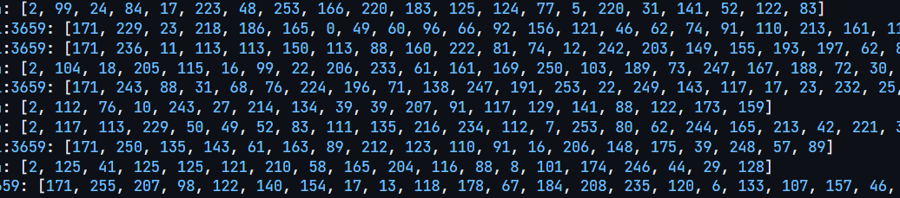
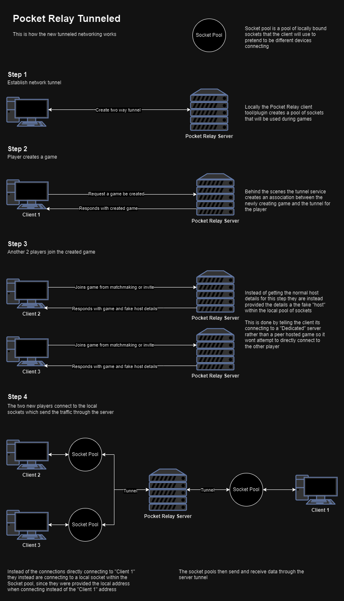
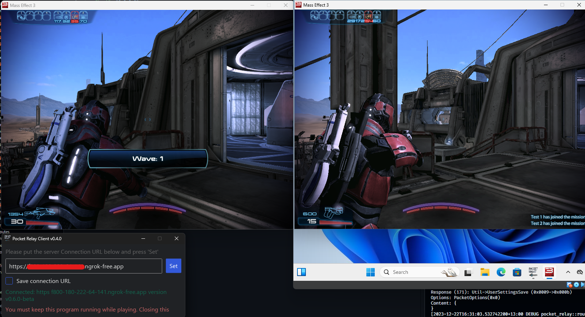

# Tunneling

The tunneled networking and how it works

## The problem

Mass Effect 3's server setup employs a **Peer-Hosted** networking model, where one player acts as the host, coordinating communication. Unlike most AAA games using a **Dedicated Server** model, Mass Effect 3 faces challenges with stricter NAT, firewalls, and other security measures, hindering some players from hosting games.

Here's a diagram illustrating the normal networking process using official servers:

## Discovering the solution

Follow along below with my journey of discovering how I could solve this issue

### Uncovering the dedicated topology

While experimenting with game setup packets, I discovered an "Game network topology" enum field, defaulting to `0x0` for the `PEER_HOSTED` network topology. Contrary to my previous assumptions, the game does in fact supports a `0x1` aka `DEDICATED` mode.

In the official server, when the `PEER_HOSTED` game network topology is set, game clients connect to the host player using information shared by the game server. However, in `DEDICATED` mode, clients attempt to connect to an address provided in a packet field named "HNET" (Host networking).

### Testing the new found topology

To confirm that the game itself actually supports the `DEDICATED` topology, I set up a testing server that listened for packets, standing in place of a dedicated server, forwarding the packets to a normal game host. The test was a **success!**

Clients successfully connected through the testing server, confirming the implementation of the dedicated networking topology.

### Making use of this topology

Discovering the dedicated server topology alone wasn't enough to solve the issue. Since Mass Effect 3 doesn't support running in a dedicated server mode, creating a server capable of handling game logic and state would be far too difficult/time consuming. However, having access to this topology allows instructing clients to directly connect to a specific address and port, bypassing the host player's address.

## Preparing the solution

### Idea for making use of the topology

I had come up with an idea to use the dedicated server topology to trick the host client into becoming a dedicated server. The Pocket Relay server would act as a relay for tunneling traffic. Instead of clients connecting directly to the host with the peer-hosted model, the dedicated server model instructs clients to connect to a local address. At this local address, a server forwards game packets through the Pocket Relay server, which then sends the packets to their respective peers.

### The advantages of this approach

With the game no longer directly reaching out to connect to its peers, there's no longer a concern about NAT strictness. Any player, regardless of NAT or firewall settings, can now host a game.

## Implementation

Implementing this tunneling setup involved modifying both the Pocket Relay clients and the server itself.

-   Client-side changes included creating a pool of sockets. This pool of sockets is used for communication in place of normal internet connections. The client was also modified to include a bi-directional stream connection with the server, similar to that used for the actual server data. ([PR](https://github.com/PocketRelay/PocketRelayClientShared/pull/2))
-   Server-side changes involved setting up the bi-directional stream connection, managing streams, and finding a way to associate the streams with their respective clients. ([PR](https://github.com/PocketRelay/Server/pull/65))

Progress was tracked [here](https://github.com/PocketRelay/Server/issues/64).

Here's a diagram illustrating the new networking process with the tunneling:

## Outcome

After testing myself and through members of the community, the tunneling is a **success!**

This not only resolves NAT connectivity issues but also opens up additional opportunities, making services like ngrok much easier to use. It eliminates the need for a QoS server, which was proving difficult to implement due to odd behavior.

With the new tunneling solution, there's no longer a need for software like Hamachi to create virtual LAN networks, as it introduces much less latency. Instead, services like ngrok can be used to easily run a server and connect to friends seamlessly.

Here's a screenshot of two isolated clients connected using tunneling with ngrok:

